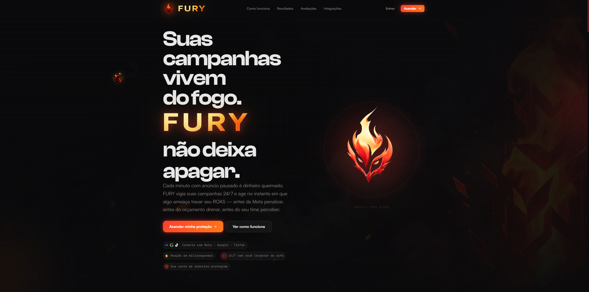
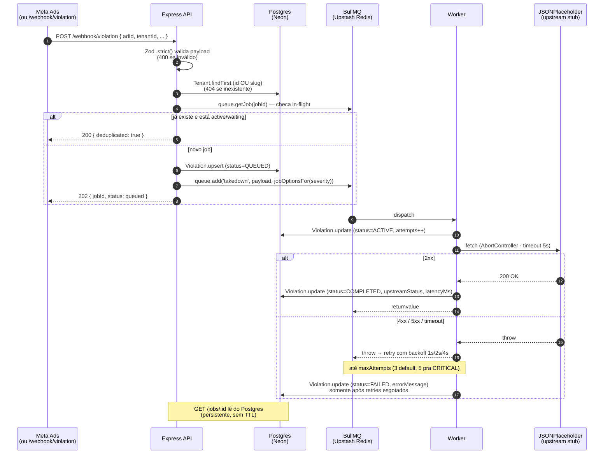

<div align="center">


# Tech Challenge

**Mini-API event-driven em Node.js + TypeScript: webhook → BullMQ → Worker → status.**

[](https://github.com/MathSchumacher/FURY-Click-Hero-Desafio-T-cnico/actions/workflows/ci.yml)
[](backend/src)
[](backend/vitest.config.ts)
[](backend/tsconfig.json)
[](backend/eslint.config.mjs)

<br />



<p><em>A landing page completa do FURY — construída em volta do core do desafio pra dar contexto de produto real (Vite + React + GSAP + R3F + Clash Display/Satoshi).</em></p>

### 🌐 Demo ao vivo

| | URL | O que tem |
|---|---|---|
| 🎨 **Frontend** | **[fury-project.netlify.app](https://fury-project.netlify.app/)** | Landing page completa + login + dashboard pós-login (Netlify) |
| ⚙️ **Backend API** | **[fury-click-hero-desafio-t-cnico.onrender.com](https://fury-click-hero-desafio-t-cnico.onrender.com/health)** | Express + BullMQ + worker (Render) — clique no link pra ver `/health` |

<sub>⏱ Primeira requisição depois de ~15 min ocioso pode demorar 30–50s — Render free tier hiberna a instância. Um GitHub Actions cron pinga `/health` a cada 10 min pra manter quente. Stack: **Netlify** (frontend estático) · **Render** (API + worker Node) · **Neon** (Postgres serverless) · **Upstash** (Redis serverless) · **Google OAuth**.</sub>

</div>

---

## 📋 Pré-requisitos

| Dependência | Versão | Pra quê |
|---|---|---|
| **Node.js** | `>= 20.x` | runtime do backend + frontend (testado em 20 LTS e 22) |
| **npm** | `>= 10.x` | vem com Node 20+ |
| **Docker** | `>= 24` *(opcional)* | sobe Redis local com 1 comando — **ou** use Upstash setando `REDIS_URL` |
| **Redis** | `>= 6` | fila BullMQ (local via Docker · cloud via Upstash · qualquer Redis-compat) |
| **Postgres** | `>= 14` | persistência relacional (users, tenants, violations) — local **ou** [Neon](https://neon.tech) free tier setando `DATABASE_URL` |

---

## 📚 Índice

- [Para o avaliador — leia primeiro](#-para-o-avaliador--leia-primeiro)
- [Os 3 comandos que provam o desafio rodando](#-os-3-comandos-que-provam-o-desafio-rodando)
- [Onde testar cada requisito](#-onde-testar-cada-requisito-acesso-rápido)
- [Arquitetura do núcleo](#-arquitetura-do-núcleo-event-driven)
- [Endpoints](#-endpoints)
- [Plataforma SaaS completa](#-plataforma-saas-completa)
- [Testes (XP Gate)](#-testes-xp-gate)
- [Variáveis de ambiente](#-variáveis-de-ambiente)
- [Severity-driven retry](#-severity-driven-retry-extra-dentro-do-tema)
- [Scripts](#-scripts-de-raiz)
- [Decisões técnicas (trade-offs)](#-decisões-técnicas-trade-offs)
- [Troubleshooting](#-troubleshooting)
- [Disciplina técnica aplicada (XP)](#-disciplina-técnica-aplicada-xp)
- [Produto FURY construído em volta do core](#-produto-fury-construído-em-volta-do-core)

---

## 👋 Para o avaliador — leia primeiro

**Onde está o core do desafio?** Tudo o que foi explicitamente pedido está em [`backend/`](backend/).
Tem também uma **landing page e dashboard pós-login** completos em [`frontend/`](frontend/) —
construídos em volta do desafio pra mostrar o produto FURY como ele seria de verdade.

```bash
# Setup completo em 60s
npm run install:all
npm run redis:up       # Docker · ou setar REDIS_URL pra Upstash em backend/.env
npm run dev            # backend :3001 + frontend :5173

# Núcleo do desafio isolado:
cd backend && npm run dev    # http://localhost:3001
```

### ⚡ Os 3 comandos que provam o desafio rodando

> **Pré-requisito:** Redis precisa estar rodando (`npm run redis:up` ou Upstash).

```bash
# 1️⃣  Enfileira um job de takedown
curl -X POST http://localhost:3001/webhook/violation \
  -H "Content-Type: application/json" \
  -d '{
    "adId":          "ad_8f3k29",
    "tenantId":      "tenant_acme",
    "violationType": "PROHIBITED_TERM",
    "severity":      "CRITICAL",
    "detectedAt":    "2026-05-21T14:23:01Z"
  }'
# → 202 Accepted { "jobId": "tenant_acme__ad_8f3k29", "status": "queued", ... }
```

```bash
# 2️⃣  Consulta o status (depois de ~2 segundos)
curl http://localhost:3001/jobs/tenant_acme__ad_8f3k29
# → 200 { "jobId": "...", "status": "completed", "attempts": 1, "result": {...}, "error": null }
```

```bash
# 3️⃣  Idempotência: segundo POST com a MESMA chave enquanto está in-flight
curl -X POST http://localhost:3001/webhook/violation \
  -H "Content-Type: application/json" \
  -d '{
    "adId":          "ad_8f3k29",
    "tenantId":      "tenant_acme",
    "violationType": "PROHIBITED_TERM",
    "severity":      "CRITICAL",
    "detectedAt":    "2026-05-21T14:23:01Z"
  }'
# → 200 { "deduplicated": true, "jobId": "tenant_acme__ad_8f3k29", "status": "waiting" }
```

**Quer ver os testes provando que tudo funciona?**

```bash
cd backend
npm test                 # 94 testes unit/integration (~5s)
npm run test:coverage    # 97% coverage no núcleo do desafio
npm run check            # XP gate completo: lint + typecheck + format + test
```

### 🧪 Onde testar cada requisito (acesso rápido)

| Requisito do desafio | Arquivo · linha |
|---|---|
| `POST /webhook/violation` com payload exato | [backend/src/routes/webhook.ts](backend/src/routes/webhook.ts) · [test](backend/src/routes/webhook.test.ts) |
| Validação Zod **400 + detalhes** | [backend/src/schemas/violation.ts](backend/src/schemas/violation.ts) · [test](backend/src/schemas/violation.test.ts) |
| BullMQ + Redis · job `takedown` | [backend/src/queue/violationQueue.ts](backend/src/queue/violationQueue.ts) + [factory](backend/src/queue/factory.ts) |
| Worker → **JSONPlaceholder** (2xx/4xx/5xx/timeout) | [backend/src/worker/upstream.ts](backend/src/worker/upstream.ts) · [test](backend/src/worker/upstream.test.ts) |
| **Retry exponencial · máx 3 tentativas** | [backend/src/queue/jobOptions.ts](backend/src/queue/jobOptions.ts) · [test](backend/src/queue/violationQueue.test.ts) |
| **Idempotência** `tenantId+adId` | `buildJobId` em [jobOptions.ts](backend/src/queue/jobOptions.ts) + dedup check em [webhook.ts](backend/src/routes/webhook.ts) |
| `GET /jobs/:id` no shape pedido | [backend/src/routes/jobs.ts](backend/src/routes/jobs.ts) · [test](backend/src/routes/jobs.test.ts) |
| README com instruções | este arquivo + [backend/README.md](backend/README.md) |

---

## 🎯 Arquitetura (event-driven + persistência relacional)



### Camadas

| Camada | Tecnologia | Papel |
|---|---|---|
| **Fila** | BullMQ + Upstash Redis | jobs ativos · retry · backoff · idempotência via jobId |
| **Persistência relacional** | Neon Postgres + Prisma | users · tenants · memberships · violations history · settings |
| **Sessão** | PASETO V4 (Ed25519) | tokens assinados · claims `{ sub, email, tenantId }` |
| **OAuth** | Google (intent-separated) | login só aceita user existente · register cria/vincula |
| **Worker** | mesmo processo do API | concurrency configurável · DB update best-effort |
| **Frontend** | Vite + React + GSAP | landing + auth + dashboard ao vivo (polling 4–5s) |

---

## 📑 Endpoints

### Core do desafio
| Método | Path | Função | Cobertura |
|---|---|---|---|
| `POST` | **`/webhook/violation`** | Valida payload + checa tenant + upsert Violation + enfileira | unit + integration + E2E real |
| `GET` | **`/jobs/:id`** | Status do job no shape do desafio (lê do Postgres) | unit + integration + E2E real |
| `GET` | `/jobs/failed` | Dead-letter inspection (jobs que esgotaram retries) | unit + integration |
| `GET` | `/health` | Redis ping + queue counts + uptime | unit + integration |
| `GET` | `/metrics` | Prometheus exposition format | unit + integration |

### Plataforma SaaS (multi-tenant)
| Método | Path | Função | Cobertura |
|---|---|---|---|
| `POST` | `/auth/register` | Cria User + Tenant + Membership OWNER (transação atômica) | integration |
| `POST` | `/auth/login` | PASETO V4.public + tenantId nas claims | integration |
| `GET` | `/auth/me` | Devolve user logado + tenantId | integration |
| `GET` | `/auth/google?intent=login\|register` | Inicia OAuth flow (intent via state) | unit |
| `GET` | `/auth/google/callback` | Recebe code → verifica id_token → find-or-create | unit |
| `GET` | `/tenants/me` | Tenant info + role do user logado (404/403 defensivos) | integration |
| `GET` | `/tenants/me/stats` | Agregação por status + severity pra dashboard | integration |
| `GET` | `/tenants/me/violations` | Histórico paginado + filtros por status/severity | integration |

### Payload exato do desafio

```json
{
  "adId":          "ad_8f3k29",        // string obrigatório, não-vazio
  "tenantId":      "tenant_acme",      // string obrigatório, não-vazio
  "violationType": "PROHIBITED_TERM",  // enum: PROHIBITED_TERM | BRAND_VIOLATION | COMPLIANCE_FAIL
  "severity":      "CRITICAL",         // enum: LOW | MEDIUM | HIGH | CRITICAL
  "detectedAt":    "2026-05-21T14:23:01Z"  // ISO 8601
}
```

Schema é **`.strict()`** — campos extras viram `400` automaticamente.

### Shape exato de `GET /jobs/:id`

```json
{
  "jobId":   "tenant_acme__ad_8f3k29",
  "status":  "completed",
  "attempts": 1,
  "result": {
    "upstreamStatus":    200,
    "upstreamLatencyMs": 134,
    "attemptedAt":       "2026-05-21T14:23:01.412Z",
    "adId":              "ad_8f3k29",
    "tenantId":          "tenant_acme"
  },
  "error": null
}
```

`status` ∈ `queued · active · completed · failed` · `404` se job não existir no DB.

---

## 🚀 Plataforma SaaS completa

O backend do desafio cresceu pra um produto real multi-tenant. Dá pra criar conta, conectar Google, simular violations pela UI, e ver tudo persistindo em Postgres.

### Schema (Prisma · 5 tabelas + 5 enums)

```
User ─┬─ Membership ──┬─ Tenant ──┬─ Integration  (Meta/Google/TikTok · fake OAuth)
      │  (role)       │           ├─ Violation    (histórico permanente)
      │               │           └─ TenantSettings (autoTakedown, thresholdHigh)
      └─ googleId? avatarUrl?
```

### Dashboard ao vivo · zero mock

Após login, [/dashboard](https://fury-project.netlify.app/dashboard) consome **5 endpoints reais** via polling 4-5s:

| Painel | Endpoint | O que mostra |
|---|---|---|
| 4 quick stats cards | `GET /tenants/me/stats` | em-processamento, concluídos, total, falhas |
| Simulate Violation form | `POST /webhook/violation` + `GET /jobs/:id` | dispara webhook real + timeline animada `queued → active → completed/failed` (polling 800ms) |
| Recent Violations list | `GET /tenants/me/violations?limit=8` | últimas 8 violations com severity pill e status badge |
| Severity Donut | `GET /tenants/me/stats` (bySeverity) | distribuição LOW/MEDIUM/HIGH/CRITICAL em donut SVG |
| Connections Health | `GET /health` | Redis · BullMQ Worker · Backend uptime + ping latency |

### Auth: PASETO V4 + Google OAuth (intent-separated)

- **PASETO V4.public** com Ed25519 (em vez de JWT — sem footguns de `alg: none`)
- **bcryptjs** cost 12 pra senhas
- **Google OAuth** com fluxos distintos:
  - Login page → `intent=login`: rejeita user inexistente com mensagem amigável
  - Register page → `intent=register`: cria User + Tenant + Membership OWNER (transação atômica) ou vincula googleId se email já existe
- `tenantId` viaja nas claims do PASETO — middlewares evitam queries extra

---

## 🧪 Testes (XP Gate)

### 94 testes em 14 arquivos · master sempre verde

| Arquivo | Cobre |
|---|---|
| `schemas/violation.test.ts` (7) | schema valid/invalid · ISO 8601 · strict · combinações |
| `queue/violationQueue.test.ts` (7) | `buildJobId` · severity routing · backoff |
| `routes/_jobState.test.ts` (3) | IN_FLIGHT_STATES + isInFlight |
| `routes/webhook.test.ts` (12) | POST integration · 202/400/200/404 · tenant validation · upsert · slug/id resolution |
| `routes/jobs.test.ts` (5) | GET shape pra cada status (lê do Postgres) |
| `routes/tenants.test.ts` (17) | `/tenants/me` · `/stats` (agregações) · `/violations` (paginação + filtros) · isolamento entre tenants |
| `routes/health.test.ts` (3) | redis up/down + queue counts |
| `routes/deadletter.test.ts` (4) | listagem failed + limit + cap |
| `routes/metrics.test.ts` (4) | formato Prometheus + uptime |
| `worker/upstream.test.ts` (5) | 2xx · 4xx · 5xx · timeout · network |
| `worker/processor.test.ts` (8) | propagação UpstreamError + writes em Violation (ACTIVE/COMPLETED) |
| `worker/onFailure.test.ts` (4) | handler de retries esgotados → Violation FAILED |
| `auth/users.google.test.ts` (7) | findOrCreateGoogleUser (3 cenários) + findGoogleUser (lookup-only) |
| `lib/requestId.test.ts` (3) | correlation id (gerado / cliente / inválido) |
| **`e2e.test.ts` (6)** | **end-to-end real com Redis (testcontainers) + Worker live** |

### E2E real cobre comportamento que mocks não conseguem

```
✓ happy path                  POST → worker → completed em ~200ms
✓ retry: falha 2x e sucede 3ª  attempts=3, completed
✓ falha definitiva 3 tentativas attempts=3, failed, error preenchido
✓ idempotência concorrente     2 POST simultâneos → 1 job só
✓ idempotência sequencial      POST durante active → 200 dedup
✓ 404                         job não existe
```

Roda automaticamente no CI ([.github/workflows/ci.yml](.github/workflows/ci.yml)) com Redis service container. Localmente faz `skip` quando Docker não está disponível.

### XP Gate completo

```bash
cd backend
npm run check
```

Executa em sequência:

| Check | Comando | Resultado |
|---|---|---|
| ESLint 9 + typescript-eslint **strict-type-checked** | `npm run lint` | ✅ 0 errors |
| TypeScript `strict + noUncheckedIndexedAccess` | `npm run typecheck` | ✅ 0 errors |
| Prettier | `npm run format:check` | ✅ all clean |
| Vitest (57 + 6 E2E) | `npm test` | ✅ all green |
| Coverage com thresholds (90% lines, 95% funcs) | `npm run test:coverage` | ✅ 97% / 100% |
| Dependency audit | `npm run audit` | ✅ 0 vulnerabilidades |

---

## ⚙️ Variáveis de ambiente

```bash
# backend/.env
PORT=3001
NODE_ENV=development
QUEUE_NAME=ad-processing
WORKER_CONCURRENCY=5

# === Redis ===
# Local (Docker)
REDIS_HOST=127.0.0.1
REDIS_PORT=6379
REDIS_PASSWORD=
# OU Upstash (TLS):
# REDIS_URL=rediss://default:<password>@<endpoint>.upstash.io:6379

# === Postgres (Neon free tier) ===
# DATABASE_URL = pooled (runtime); DIRECT_URL = direct (migrations)
DATABASE_URL=postgresql://user:pwd@<endpoint>-pooler.region.neon.tech/neondb?sslmode=require&connect_timeout=30
DIRECT_URL=postgresql://user:pwd@<endpoint>.region.neon.tech/neondb?sslmode=require&connect_timeout=30

# === Google OAuth (opcional — backend retorna 503 nas rotas /auth/google se faltar) ===
GOOGLE_CLIENT_ID=<seu-client-id>.apps.googleusercontent.com
GOOGLE_CLIENT_SECRET=GOCSPX-<seu-secret>
GOOGLE_REDIRECT_URI=http://localhost:3001/auth/google/callback
FRONTEND_URL=http://localhost:5173

# === Upstream ===
UPSTREAM_URL=https://jsonplaceholder.typicode.com/posts/1
UPSTREAM_TIMEOUT_MS=5000
```

Todas validadas via Zod em [backend/src/config/env.ts](backend/src/config/env.ts) — boot falha cedo se inválidas. Veja [backend/.env.example](backend/.env.example) pra template completo.

**`frontend/.env`**:
```bash
# Em dev fica vazio (Vite proxy /api → localhost:3001).
# Em prod (Netlify): apontar pra Render.
VITE_API_URL=https://fury-click-hero-desafio-t-cnico.onrender.com
```

---

## 🎚 Severity-driven retry (extra dentro do tema)

O desafio pede `attempts: 3 + backoff exponencial`. Esse mínimo está cumprido. O enum de `severity` foi aproveitado pra escalar a resposta:

| Severity | Priority (menor = primeiro) | Attempts |
|---|---|---|
| `CRITICAL` | 1 | **5** |
| `HIGH` | 2 | 4 |
| `MEDIUM` | 3 | 3 *(default do desafio)* |
| `LOW` | 4 | 3 *(default do desafio)* |

Backoff exponencial `1s/2s/4s` em todos os níveis. Pure function em [jobOptions.ts](backend/src/queue/jobOptions.ts) com 7 testes.

---

## 📜 Scripts de raiz

| Comando | O que faz |
|---|---|
| `npm run install:all` | instala root + backend + frontend |
| `npm run dev` | sobe backend + frontend juntos (`concurrently`) |
| `npm run dev:backend` | só backend |
| `npm run redis:up` / `redis:down` | Docker compose pro Redis local |

### Scripts do backend (`cd backend && ...`)

| Comando | O que faz |
|---|---|
| `npm run dev` | servidor com hot reload (tsx watch) |
| `npm test` | 57 testes + 6 E2E (skip se sem Docker) |
| `npm run test:coverage` | + thresholds + relatório HTML |
| `npm run lint` | ESLint 9 strict-type-checked |
| `npm run format` | Prettier write |
| `npm run typecheck` | `tsc --noEmit` strict |
| `npm run audit` | `npm audit --audit-level=moderate` |
| **`npm run check`** | **XP gate: lint + typecheck + format:check + test em sequência** |
| `npm run build` | compila pra `dist/` |

---

## 🧭 Decisões técnicas (trade-offs)

Cada escolha aqui foi um trade-off consciente — o que ganhei e o que abri mão:

| Decisão | Por quê | O que ganho | O que abro mão |
|---|---|---|---|
| **`jobId = ${tenantId}__${adId}`** como chave determinística | É a forma mais simples de garantir idempotência sem tabela extra | Dedup gratuito vindo do BullMQ + zero schema novo | Separador `__` em vez de `:` (BullMQ reserva `:`) — exige doc explícita |
| **BullMQ + Redis** em vez de RabbitMQ/Kafka/SQS | Desafio cabe em 1 processo; quero retries+backoff prontos e visibilidade rápida | Setup em minutos, dead-letter inspection, métricas de fila out-of-the-box | Single-broker SPOF (em produção: cluster Redis ou trocar pra SQS) |
| **Worker no mesmo processo do API (`npm run dev`)** | Foco do desafio é o fluxo, não infra distribuída | Boot único, debug fácil, E2E real roda no CI sem orquestração | Não escala worker independente do API — separação trivial via `tsx watch src/worker.ts` |
| **Testcontainers no E2E, mock em unit/integration** | Mocks de Redis mentem; mas E2E real é lento demais pra cada unit | 6 testes E2E provam o contrato real; 51 unit/integration rodam em <2s | Docker obrigatório no CI (skip local automático quando ausente) |
| **PASETO V4 + Ed25519** em vez de JWT | JWT tem footguns conhecidos (`alg: none`, algoritmo confusion); PASETO é versionado | Sem zona cinzenta de algoritmo, chaves Ed25519, libs pequenas | Ecossistema menor que JWT — menos integrações prontas (mas o middleware reusável compensa) |
| **Severity escala attempts (3→5)** em vez de fixo 3 | Aproveita o enum que o desafio já pede; CRITICAL merece persistir mais | Resposta proporcional à criticidade sem novo campo | Mais variabilidade de duração de job — observável via `/metrics` |

---

## 🆘 Troubleshooting

| Sintoma | Causa provável | Como resolver |
|---|---|---|
| `Error: connect ECONNREFUSED 127.0.0.1:6379` ao subir o backend | Redis não está rodando | `npm run redis:up` (Docker) **ou** setar `REDIS_URL=rediss://...` no `backend/.env` apontando pra Upstash |
| `Error: listen EADDRINUSE: :::3001` | Porta 3001 ocupada (outro processo ou backend já rodando) | `npx kill-port 3001` **ou** trocar `PORT` no `backend/.env` |
| `docker: command not found` ao rodar E2E | Docker Desktop não instalado/rodando | Os 6 testes E2E ficam `skipped` automaticamente — os 57 unit/integration rodam normal. Pra rodar E2E: instale Docker Desktop |
| `Custom Id cannot contain :` no log | Tentando enfileirar com jobId contendo `:` | Já corrigido — separador agora é `__`. Se aparecer em código novo, evite `:` em ids custom (BullMQ reserva esse char) |
| Frontend abre mas backend não responde | Você rodou só `npm run dev:frontend` | Use `npm run dev` (sobe os dois) ou em paralelo `cd backend && npm run dev` |
| Coverage falhando localmente após rebase | Cache antigo do Vitest/coverage | `rm -rf backend/coverage backend/node_modules/.vite && cd backend && npm run check` |

---

## 🏗 Disciplina técnica aplicada (XP)

1. **TDD em cada feature** — vermelho → verde → refator. Bug do `AbortError` no Node 18+ undici foi detectado pelo teste antes do código.
2. **Menor diff possível** — extrações (`upstream`, `processor`, `_jobState`, `factory`, `createWorker`) só onde reduziam risco. Sem renomear/mover por estética.
3. **Sem `any` espalhado** — `strict + noUncheckedIndexedAccess` no TS; ESLint `strictTypeChecked` no lint; `unknown` em catch.
4. **YAGNI** — campos não-utilizados removidos do retorno do upstream; nada antecipado.
5. **Pure functions separadas do I/O** — `buildJobId`, `jobOptionsFor`, `isInFlight`, `isAbortError` testáveis sem Redis.
6. **DI leve** — `callUpstream(url, timeout, fetchImpl)`, `createViolationQueue(name, connection)`, `createTakedownWorker(name, connection)` permitem testes com Redis real OU mock conforme contexto.
7. **Observability** — pino structured logs + correlation id (X-Request-Id) + `/health` + `/metrics` + dead-letter inspection.
8. **CI verde antes de merge** — workflow GitHub Actions com Redis service container; XP gate completo em cada PR.

Roadmap detalhado de 9 → 10: [backend/ROADMAP.md](backend/ROADMAP.md).

---

## 🎁 Produto FURY construído em volta do core

Pra mostrar o que o desafio resolve no mundo real, construí o produto completo
em volta do núcleo do webhook. Tudo em arquivos separados — **não interfere com
o fluxo do desafio**. O núcleo (`webhook → fila → worker → status`) roda
isolado com `cd backend && npm run dev`.

### Frontend ([frontend/](frontend/))

- **Landing page** — Vite + React + GSAP + R3F · 12 seções animadas, modelo 3D interativo, splash com iris reveal, cursor custom com trail de embers
- **Dashboard pós-login** ([Dashboard.tsx](frontend/src/pages/Dashboard.tsx)) — ROAS ao vivo (Catmull-Rom spline), event log animado, severity donut, connections panel
- **Login + Register** com PASETO V4 real ([Login.tsx](frontend/src/pages/Login.tsx)) — split-screen, password strength meter, error shake
- **Responsivo** em 5 breakpoints (375 / 640 / 960 / 1100 / 1400+)

### Backend bonus ([backend/src/auth/](backend/src/auth/))

- **Auth PASETO V4** com Ed25519 + bcrypt cost 12 · `POST /auth/register`, `POST /auth/login`, `GET /auth/me` + middleware `requireAuth` reusável

### Por que está aqui

O desafio pede uma mini-API isolada. Eu entreguei isso (e mais — coverage, E2E, CI), MAS também
quis mostrar como esse núcleo se encaixaria num produto real — porque é assim que código de
produção vive. Os extras estão em arquivos independentes, não acoplam com o core e não
poluem o XP gate do backend (auth está excluído do scope de coverage, frontend tem seu
próprio pipeline).

---

<div align="center">

**Matheus Schumacher** · [GitHub](https://github.com/MathSchumacher) · Desafio técnico FURY · 2026

[](https://github.com/MathSchumacher/FURY-Click-Hero-Desafio-T-cnico/actions/workflows/ci.yml) · MIT

</div>
