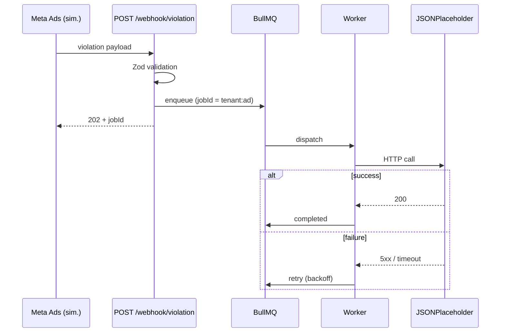

# FURY — Roadmap (Pós Landing Page)

> Plano de execução do desafio técnico após a landing page estar pronta.
> Foco: entregar **100% dos requisitos** do desafio + extras que demonstram senioridade Pleno.

---

## Status atual

### ✅ Já temos (do setup inicial)
- Monorepo com `concurrently` (`npm run dev` sobe tudo)
- Backend Node.js + TypeScript estrito (sem `any`)
- Express + CORS + dotenv
- Zod schema para validação
- BullMQ + ioredis (Docker local ou Upstash via `REDIS_URL`)
- Worker com `attempts: 3` + backoff exponencial
- Idempotência via `jobId = ${tenantId}:${adId}`
- `GET /jobs/:id` retornando `{ jobId, status, attempts, result, error }`
- README com instruções de setup
- Frontend Vite + React + TypeScript + vanilla CSS (form de teste do job)
- Docker compose para Redis

### ⚠️ Gap em relação ao desafio
O setup atual usa um **payload genérico de "ad processing"** com `title`, `description`, `imageUrl`, `budget`. O desafio pede o **payload de violação** específico:

```ts
{
  adId: string,
  tenantId: string,
  violationType: "PROHIBITED_TERM" | "BRAND_VIOLATION" | "COMPLIANCE_FAIL",
  severity: "LOW" | "MEDIUM" | "HIGH" | "CRITICAL",
  detectedAt: string  // ISO 8601
}
```

E o worker deve **chamar HTTP externo** (JSONPlaceholder) em vez do processamento mock atual.

---

## Roadmap

### Fase 0 — Landing page (separada, em andamento)
Conforme `landing_page_context.md`. Não detalhada aqui.

---

### Fase 1 — Aderência total ao desafio (PRIORIDADE)

> Tudo nessa fase é obrigatório para o desafio ser considerado "completo".

#### 1.1 Atualizar schema de payload
**Arquivo:** `backend/src/schemas/ad.ts` → renomear para `violation.ts`

```ts
export const violationPayloadSchema = z.object({
  adId: z.string().min(1),
  tenantId: z.string().min(1),
  violationType: z.enum(['PROHIBITED_TERM', 'BRAND_VIOLATION', 'COMPLIANCE_FAIL']),
  severity: z.enum(['LOW', 'MEDIUM', 'HIGH', 'CRITICAL']),
  detectedAt: z.string().datetime(),
});
```

- Apagar/migrar campos antigos (`title`, `description`, `imageUrl`, `budget`, `targeting`)
- Atualizar tipos exportados (`ViolationPayload`)

#### 1.2 Mudar rota: `POST /jobs` → `POST /webhook/violation`
**Arquivo:** `backend/src/routes/jobs.ts` → renomear para `webhook.ts` (manter `jobs.ts` só para GET /jobs/:id)

- Endpoint `POST /webhook/violation`
- Validação com Zod, `400` com detalhes em caso de erro
- Idempotência mantida (jobId = `${tenantId}:${adId}`)
- `GET /jobs/:id` permanece igual

#### 1.3 Worker faz chamada HTTP externa real
**Arquivo:** `backend/src/worker.ts`

- Remover lógica de mock atual (sleep + random fail)
- Usar `fetch` global do Node 20 (ou `undici`) para chamar `https://jsonplaceholder.typicode.com/posts/1`
- Timeout via `AbortController` (5s)
- Tratar:
  - **2xx** → success, salva `result: { status, data }`
  - **4xx/5xx** → throw `Error` (BullMQ retry kicks in automaticamente)
  - **timeout** → throw `Error('upstream timeout')`
- Manter `attempts: 3` + backoff exponencial já configurado

```ts
async function callMetaAdsStub(): Promise<{ status: number; data: unknown }> {
  const controller = new AbortController();
  const timeout = setTimeout(() => controller.abort(), 5000);
  try {
    const res = await fetch('https://jsonplaceholder.typicode.com/posts/1', {
      signal: controller.signal,
    });
    if (!res.ok) throw new Error(`upstream returned ${res.status}`);
    return { status: res.status, data: await res.json() };
  } finally {
    clearTimeout(timeout);
  }
}
```

#### 1.4 Severity-based routing (opcional mas alto valor)
O desafio define 4 níveis de severidade — usar isso para diferenciar comportamento:

- `LOW` → apenas loga, não enfileira job (ou enfileira com `priority` baixa)
- `MEDIUM` → enfileira normal
- `HIGH` → enfileira com `priority` alta
- `CRITICAL` → enfileira com `priority` máxima + `attempts: 5`

Demonstra entendimento do domínio, não só execução do checklist.

#### 1.5 Atualizar README
- Trocar exemplos curl (`POST /jobs` → `POST /webhook/violation`)
- Atualizar payload de exemplo
- Documentar comportamento de severity
- Documentar que worker chama JSONPlaceholder como stub da Meta Ads

---

### Fase 2 — Frontend: Job Tracker UI

Transformar o form atual em um **mini-dashboard** que combina com a estética da landing page (dark mode, severity pills, observability vibe).

#### 2.1 Tela "Simulate Violation"
- Form para disparar webhook (já existe, só adaptar campos)
- Dropdowns para `violationType` e `severity`
- DatePicker (ou auto-fill com `new Date().toISOString()`) para `detectedAt`
- Preview do payload JSON antes de enviar

#### 2.2 Tela "Live Jobs"
- Lista de jobs ativos / recentes
- Cada card mostra: adId, tenantId, severity pill, status, attempts, timestamp
- Polling automático (ou EventSource/SSE no futuro)
- Cores e badges seguindo design system da landing

#### 2.3 Tela "Job Detail"
- Timeline visual: queued → active → completed/failed
- Histórico de attempts
- Response do JSONPlaceholder (collapsible JSON viewer)
- Botão "Retry manually" (opcional)

#### 2.4 Componentes compartilhados com a landing
- `SeverityPill` (LOW/MED/HIGH/CRITICAL)
- `StatusBadge` (queued/active/completed/failed)
- `CodeBlock` (para mostrar payloads)
- `Card`, `Button`, `Input` consistentes

---

### Fase 3 — Polish técnico (diferencial Pleno)

Coisas que **não** são pedidas mas mostram maturidade.

#### 3.1 Testes
- **Unit:** schema Zod (casos válidos/inválidos)
- **Unit:** worker logic (mock do fetch, testa retry/success/failure)
- **Integration:** POST /webhook/violation → job criado na fila (usar Redis real ou `ioredis-mock`)
- **Integration:** idempotência (POST 2x retorna `deduplicated: true`)
- Framework: **Vitest** (rápido, bom DX, funciona em backend e frontend)

#### 3.2 Logging estruturado
- Trocar `console.log` por **pino** com pretty-print em dev
- Logs com `jobId`, `adId`, `tenantId`, `severity`, `attempt` como campos estruturados
- Facilita debug e parece "production-ready"

#### 3.3 Observability mínima
- Endpoint `GET /metrics` com contagem básica (jobs queued/active/completed/failed por severity)
- Útil para mostrar na própria UI

#### 3.4 Rate limiting no webhook
- `express-rate-limit` por `tenantId`
- Demonstra preocupação com abuse / multi-tenant

#### 3.5 Graceful shutdown completo
- SIGTERM/SIGINT já existe no worker — replicar no HTTP server
- Drain de jobs em andamento antes de matar processo

#### 3.6 Worker em processo separado (opcional)
- Hoje roda no mesmo processo do HTTP
- Documentar como rodar `npm run worker` separado para escalar horizontalmente
- README já menciona isso, só precisa garantir que funciona

---

### Fase 4 — Documentação e entrega

#### 4.1 README final
- Print/GIF da landing page
- Print/GIF do dashboard rodando
- Diagrama de arquitetura (Mermaid funciona no GitHub)
- Seção "Decisões técnicas" explicando:
  - Por que BullMQ (e não Kafka, RabbitMQ, etc.)
  - Por que idempotência por `tenantId:adId`
  - Por que severity routing
  - Trade-offs assumidos
- Seção "Próximos passos" mostrando visão de longo prazo

#### 4.2 Diagrama Mermaid


#### 4.3 Vídeo/Loom (opcional, alto impacto)
- 2-3 min mostrando: landing → form → job tracker → retry em ação
- Anexar link no README

#### 4.4 Deploy demo (opcional)
- Backend em **Railway** ou **Render** (free tier, Redis incluso)
- Frontend em **Vercel**
- Link público no README

---

## Critérios de "pronto"

### Mínimo aceitável (cumpre o desafio)
- [ ] `POST /webhook/violation` com payload correto e Zod
- [ ] Job enfileirado em BullMQ
- [ ] Worker chama JSONPlaceholder
- [ ] Retry com backoff exponencial (3 tentativas)
- [ ] Idempotência adId+tenantId
- [ ] `GET /jobs/:id` no formato pedido
- [ ] README com setup local
- [ ] Sem `any` no código

### Nível Pleno (o que abre porta)
- [ ] Tudo acima +
- [ ] Frontend funcional integrado (não só curl)
- [ ] Landing page de qualidade enterprise
- [ ] Pelo menos uns 5–10 testes cobrindo casos críticos
- [ ] Severity routing implementado
- [ ] Logs estruturados
- [ ] Diagrama de arquitetura no README
- [ ] Decisões técnicas documentadas

### Nível "wow"
- [ ] Deploy público funcionando
- [ ] Vídeo demo
- [ ] Métricas básicas expostas
- [ ] Rate limiting por tenant
- [ ] Worker isolável em processo separado

---

## Sequência de execução sugerida

1. **Landing page** (já em andamento) — primeira impressão importa
2. **Fase 1** — alinhar 100% com requisitos do desafio (1 sessão de ~2h)
3. **Fase 2.1 + 2.2** — dashboard mínimo conectado à landing (1 sessão)
4. **Fase 3.1** — testes core (1 sessão)
5. **Fase 4.1 + 4.2** — README final + diagrama (~1h)
6. **Extras conforme tempo restante** — 3.2 a 3.6, 4.3, 4.4

Total estimado: **8–12h de trabalho focado** para chegar no nível Pleno completo.
